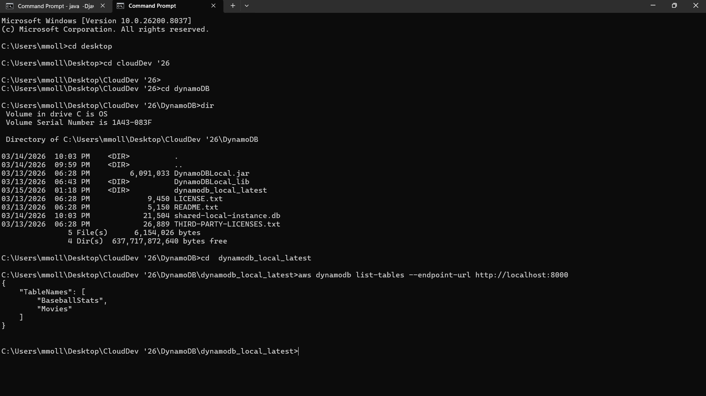
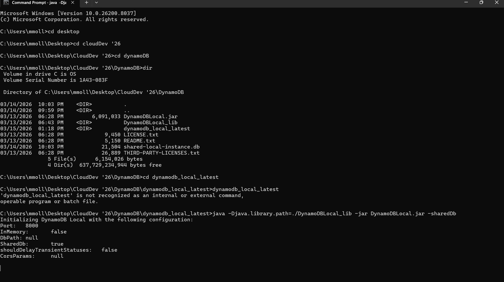
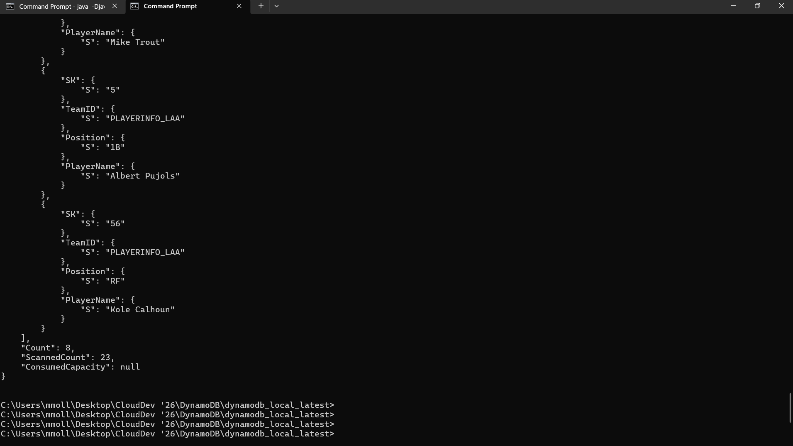

# DynamoDB Baseball API

## About
This project focused on building a cloud-based baseball statistics API using AWS services and DynamoDB.

## Technologies Used
- AWS Lambda
- API Gateway
- DynamoDB
- AWS CLI
- NodeJS
- JavaScript

## Features
- Created DynamoDB tables locally and in AWS
- Seeded baseball data into DynamoDB
- Used scan and filter expressions
- Built Lambda functions for GET and POST requests
- Connected API Gateway endpoints to Lambda
- Tested REST API endpoints

## What I Learned
- DynamoDB table structure
- AWS CLI commands
- Serverless architecture
- API development
- Lambda integrations
- Cloud database management

## Screenshots

## DynamoDB Local Running

## AWS CLI List Tables

## Player Filter Results

## Author
Maipa Ly
